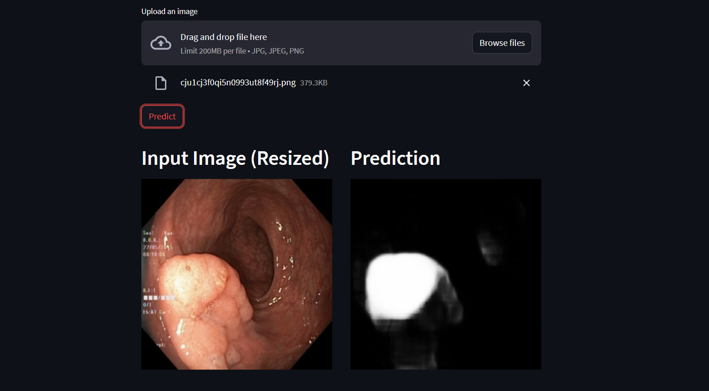
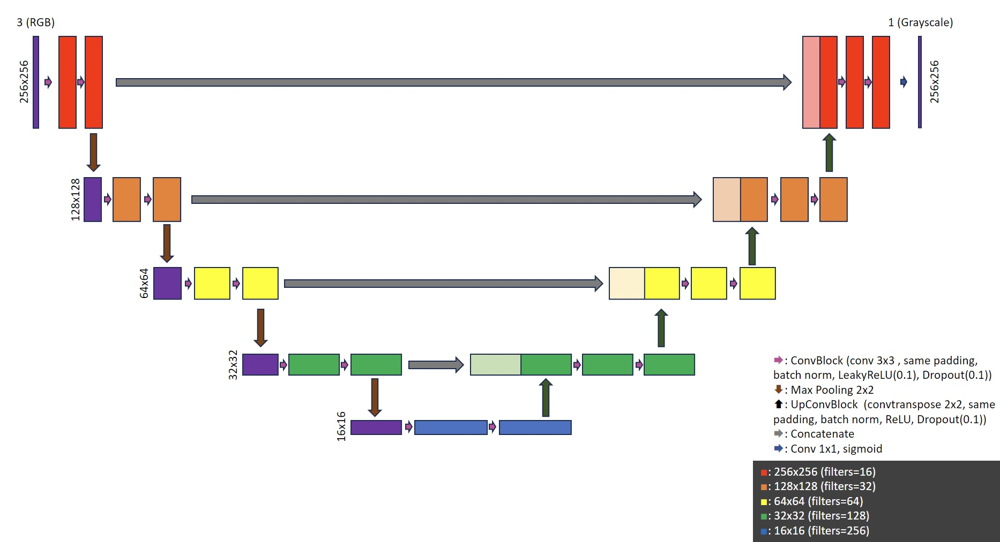
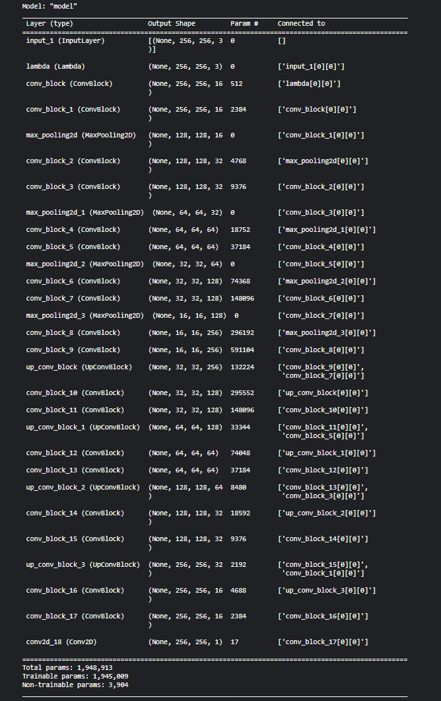

# NTC-Polyp-Semantic-Segmentation

You can try out the live demo here : [NTC Polyp Semantic Segmentation App](https://ntc-polyp-semantic-segmentation.streamlit.app/)

## Introduction

This is an AI application that provide aids for medical professionals in detecting polyps.
You can read more about polyps here : [Understanding Polyps and Their Treatment](https://www.asge.org/home/for-patients/patient-information/understanding-polyps)

In this application, user can upload an image and the AI model will predict the region that may have polyps and show the prediction and the original image side-by-side (image below).

## Technical Overview

### Model Building

The ML model uses a [U-net architecture](https://arxiv.org/pdf/1505.04597.pdf), which is a type of Convolutional Neural Network (CNN) that does not have any fully-connected layers. U-net has been proven to be useful in Semantic Segmentation problems, especially those in medical field where there are limited number of images available to the public.

The model I built have some modifications so it can be more suitable for the problem at hand. The model can be describe using the following figure:

The main difference of this model from the one in the paper is the use of **padding**, which helped retain the image dimensions after each convolution layer. I also include **Batch Normalization** in the ConvBlock in order to improve efficiency and stability of the model. The convolution blocks **using LeakyReLU as activation function instead of ReLU** was the decision that I made based on [this paper](https://arxiv.org/pdf/1511.06434.pdf). The upconvolution blocks, on the other hand, still use the regular ReLU.

Here is the summary of the model after the implementation using Keras:

