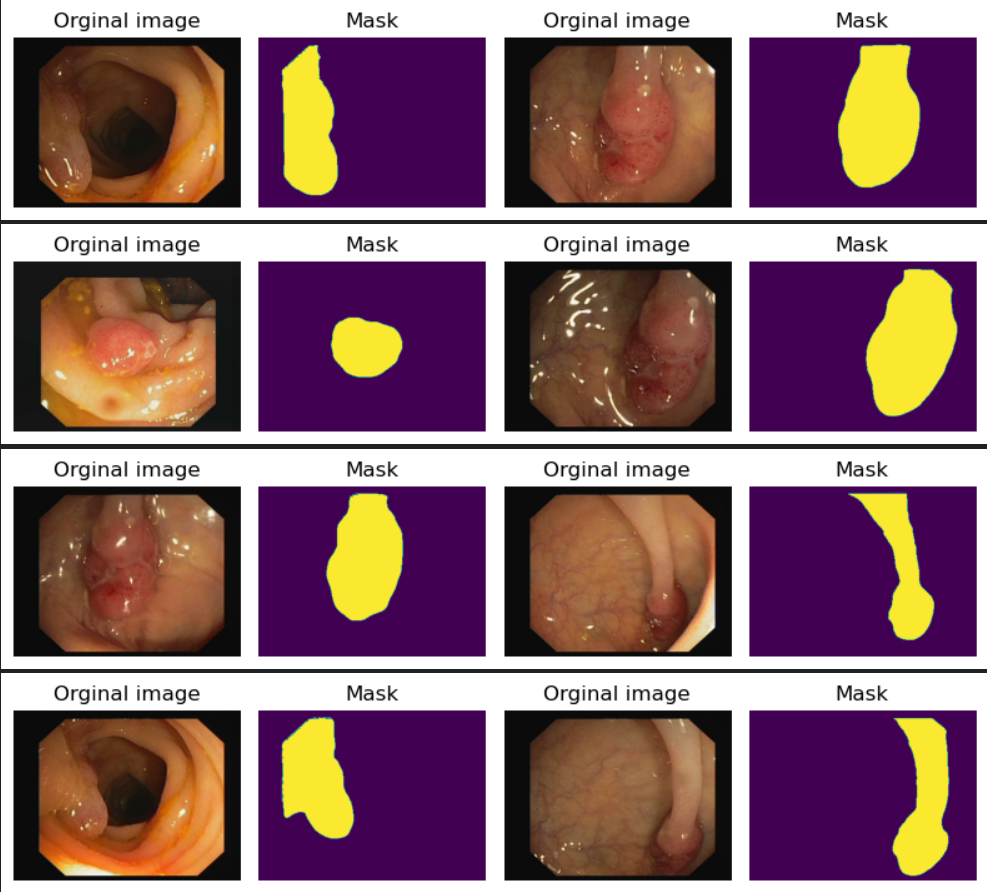
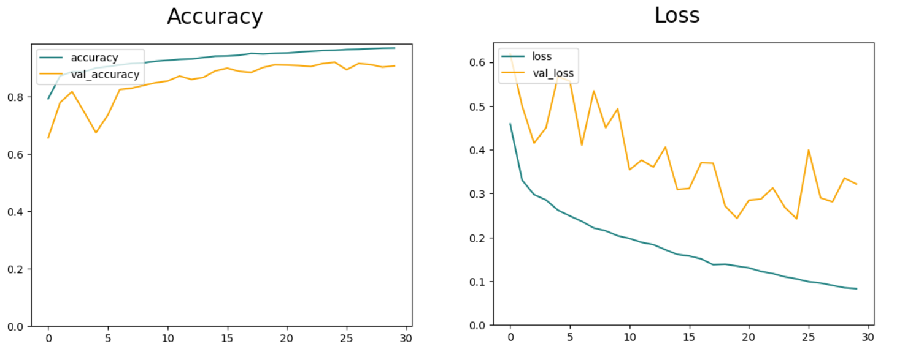
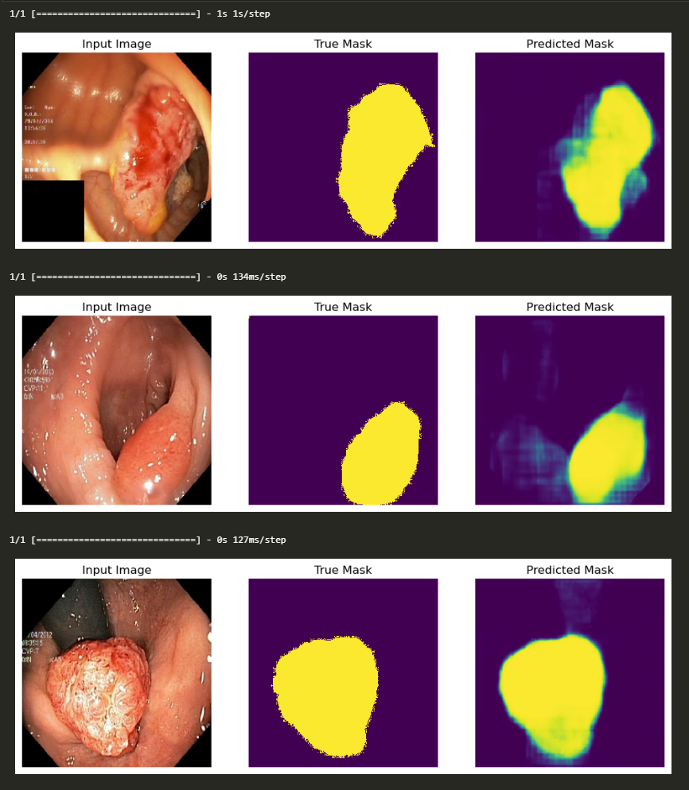

# NTC-Polyp-Semantic-Segmentation

You can try out the live demo here : [NTC Polyp Semantic Segmentation App](https://ntc-polyp-semantic-segmentation.streamlit.app/)

## Introduction

This is an AI application that provides aids for medical professionals in detecting polyps.
You can read more about polyps here : [Understanding Polyps and Their Treatment](https://www.asge.org/home/for-patients/patient-information/understanding-polyps)

In this application, the user can upload an image and the AI model will predict the region that may have polyps and show the prediction and the original image side-by-side (image below).


Or you can clone this repo and run the following command from its root directory:

```console
cd app
pip install requirements.txt
streamlit run app.py
```

## Technical Overview

### Dataset

The train dataset, as well as the test dataset used are from Kvasir-SEG Dataset from [Real-Time Polyp Detection, Localization and Segmentation in Colonoscopy Using Deep Learning](https://arxiv.org/abs/2011.07631). I have included the datasets in this repository:

[Train Dataset](notebook/inputs/TrainDataset/)

[Test Dataset](notebook/inputs/TestDataset/Kvasir/)

Here are some plotted samples from the train dataset:



### Model Building

The ML model uses a [U-net architecture](https://arxiv.org/pdf/1505.04597.pdf), which is a type of Convolutional Neural Network (CNN) that does not have any fully-connected layers. U-net has been praised for its usefulness in Semantic Segmentation problems, especially those in medical fields where there is a limited number of images available to the public.

The model I built is a modified version of the original U-net so it can be more suitable for the problem at hand. The model can be described using the following figure:


The main difference between this model and the one in the paper is the use of **padding**, which helped retain the image dimensions after each convolution layer. I also include **Batch Normalization** in the ConvBlock in order to improve the efficiency and stability of the model. The convolution blocks **using LeakyReLU as the activation function instead of ReLU** was the decision that I made based on [this paper](https://arxiv.org/pdf/1511.06434.pdf). The upconvolution blocks, on the other hand, still use the regular ReLU. The weights are initialized with [He normal initializer](https://www.tensorflow.org/api_docs/python/tf/keras/initializers/HeNormal).

Here is the summary of the model after the implementation using Keras. A Lambda layer is included in the model to perform **normalization on the input image (divide the RGB values by 255 each)** for better results:


### Data Preprocessing & Model Training

The dataset for training is split into 2 parts: Training and Validation. The ratio of training and validation data is 8:2. The images from the dataset are then resized to (256, 256) with 3 channels - RGB to match the model's input. No pixel normalization is needed since it is already integrated into the model.

The model is then trained using early stopping and model checkpoint callbacks to avoid overfitting. The batch size used is 32. The model then trained for 50 epochs but early stopped at 30, the saved model is from epoch 25.

Here are the graphs for accuracy and loss(the loss function used is Binary Cross-entropy Loss Function):



The loss graph is a little bit bumpy but overall the training process is a success.

### Testing & Result

The testing result is based on 3 metrics namely precision, recall, and accuracy. I also plotted the first 10 outputs and show them next to the ground truths and original images respectively:



Regarding the metrics, here are the results:

| Metric        | Value  |
| ------------- | ------ |
| **Precision** | 0.8295 |
| **Recall**    | 0.6989 |
| **Accuracy**  | 0.9315 |

### Conclusion

Despite its age, U-net architecture has proven itself to be still effective in medical segmentation problems.
